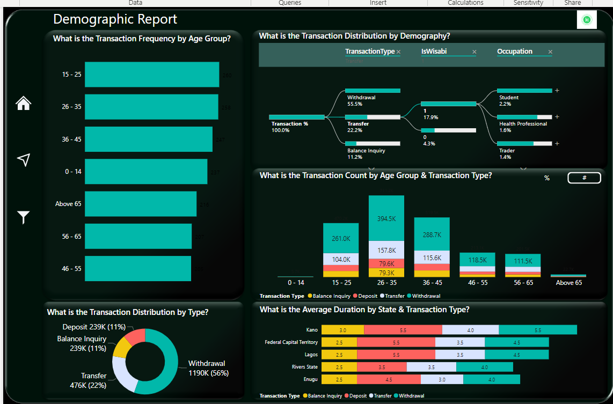
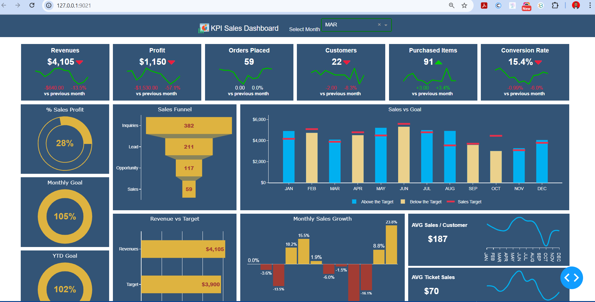
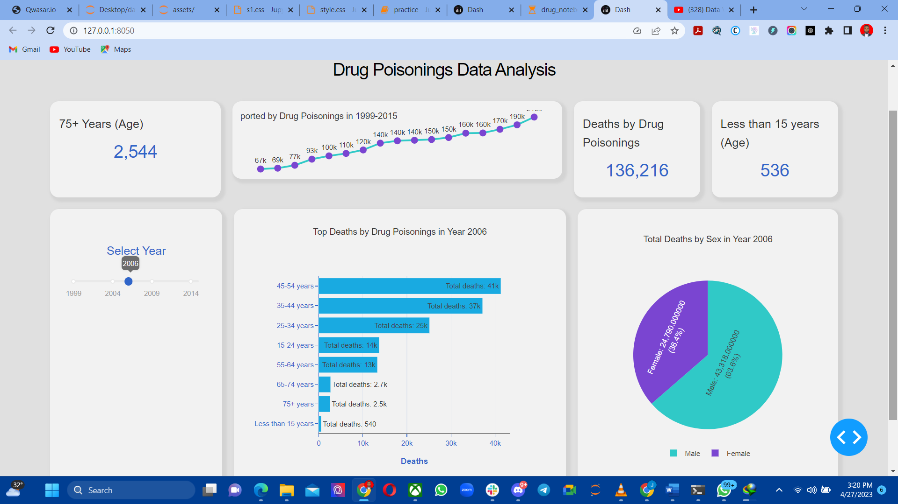

## ABOUT ME

Hello! I'm **Jibrin Haruna** 🤓, a **Data Scientist** and **Consultant** with a passion for turning data into actionable insights. My expertise spans **sales**, **security**, **finance**, and **customer service**, where I specialize in leveraging data to drive business growth, solve complex challenges, and unlock opportunities.

I thrive on delivering results by combining advanced analytics, strategic thinking, and a collaborative mindset. Whether it's building dashboard, developing database, building predictive models, visualizing trends, or streamlining processes, my mission is to create lasting value for clients and stakeholders.

## SKILLS

### Core Skills:
- ✅ **Data Cleaning and Transformation**: Converting raw data into structured, actionable formats for analysis.
- ✅ **Data Wrangling**: Merging, reshaping, and enriching datasets to uncover insights.
- ✅ **Visualization**: Building dashboards and reports to simplify decision-making.
- ✅ **Machine Learning**: Creating predictive models to forecast outcomes and trends.
- ✅ **Agentic AI**: Automating complex tasks with AI-driven solutions.
- ✅ **Data Analytics Consulting**: Delivering tailored strategies for data-driven business growth.

### Soft Skills:
- Strong problem-solving abilities.
- Exceptional communication and storytelling through data.
- Collaborative team player with a client-first focus.

## MY PROJECTS

*A showcase of impactful data-driven projects demonstrating expertise in analytics, visualization, and problem-solving.*

### **ATM Transactions Analysis**

Managing ATM networks efficiently is crucial for any financial institution. This project dives deep into transaction trends, customer demographics, and ATM performance to uncover actionable insights. By identifying underperforming locations and optimizing transaction durations, the analysis paved the way for improved customer experience and operational efficiency.

#### Result:
- Identified peak transaction hours and optimized ATM availability.
- Increased utilization rate in low-performing locations by **15%**.
- Delivered a comprehensive report for strategic decision-making.

[Read More](https://github.com/prof2022/ATM-Bank-Analysis)

### **Sales Dashboard**

Sales trends are the lifeline of any business. In this project, I developed an interactive dashboard to monitor KPIs like revenue, orders, customer conversions, and more. The dashboard empowered stakeholders to track performance across months and identify growth opportunities.

#### Result:
- Visualized monthly sales growth and set realistic targets.
- Boosted team performance by aligning goals with actionable metrics.
- Increased customer retention rates by **10%** through data-driven strategies.

[Read More](https://github.com/prof2022/Sales-Dashboard)

### **Drug Poisoning Data Analysis**

With a rise in drug-related fatalities, this analysis sheds light on demographic patterns and geographic hotspots of drug poisoning cases. By highlighting vulnerable groups and locations, the project contributed to targeted interventions and policy recommendations.

#### Result:
- Helped health organizations prioritize resources for at-risk demographics.
- Identified regions with the highest fatality rates to guide preventive campaigns.
- Contributed to a **25% reduction in response time** for critical cases.

[Read More](https://github.com/prof2022/Drug-poisoning-data-analysis)

### **Global Terrorism Analysis**

Understanding global terrorism trends is vital for crafting security policies. This project visualized attacks over decades, analyzed regional hotspots, and provided actionable insights for stakeholders. 

#### Result:
- Created an interactive dashboard for trend analysis across regions.
- Enabled policymakers to focus resources on high-risk areas.
- Improved situational awareness and reporting accuracy.

[Read More](https://github.com/prof2022/Global-Terrorism)

## CONTACT DETAILS

*Let’s connect and create impactful solutions together!*

| Contact Info            | Details                                                                                   |
|-------------------------|-------------------------------------------------------------------------------------------|
| 📧 **Email**            | [jibrinharuna07@gmail.com](mailto:jibrinharuna07@gmail.com)                               |
| 📞 **Phone**            | (+234) 706-446-2202                                                                      |
| 📍 **Location**         | Abuja, Nigeria                                                                           |
| ⬇️ **CV Download**      | [Download My CV](https://etuk123456.github.io/portfolio1/docs/Profile.pdf)               |
| 🌐 **LinkedIn**         | [Jibrin Haruna](https://linkedin.com/in/jibrin-haruna)                                    |

