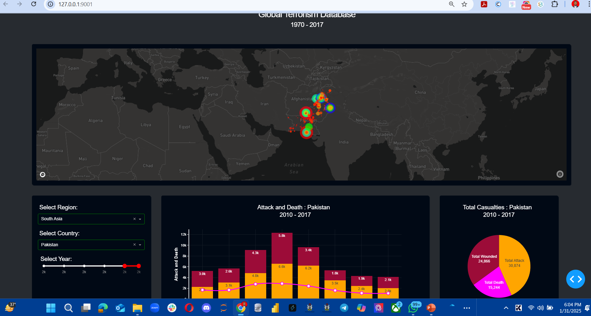

<!--Section 1: Introduce your self-->
## ABOUT ME

Hello! I'm Jibrin Haruna 🤓, a data scientit and a consultant with a passion for turning data into actionable insights. With experience across sales, security, finance, and customer service, I help businesses solve challenges and unlock growth.

<!--Mention your top/relevant skills here - core and soft skills-->
## SKILLS

**- ✅ Data cleaning and transformation.**
I provide in-depth analysis and tailored solutions to help you make data-driven decisions, optimize processes, and drive business growth. 

**- ✅ Data wrangling.**
I provide in-depth analysis and tailored solutions to help you make data-driven decisions, optimize processes, and drive business growth.

**- ✅ visualization.**
I provide in-depth analysis and tailored solutions to help you make data-driven decisions, optimize processes, and drive business growth. 

**- ✅ Machine learning.**
I provide in-depth analysis and tailored solutions to help you make data-driven decisions, optimize processes, and drive business growth. 
**- ✅ Agentic AI.**
I provide in-depth analysis and tailored solutions to help you make data-driven decisions, optimize processes, and drive business growth. 
**- ✅ Data Analytics Consulting.**
I provide in-depth analysis and tailored solutions to help you make data-driven decisions, optimize processes, and drive business growth. 

<!--Section 2: List 3-4 key projects-->
## MY PROJECTS 

*A glimpse of some of my Data analysis projects .*

**ATM Transaction Analysis.**

The sinking of the Titanic is one of the most infamous shipwrecks in history.

[Read More](https://www.linkedin.com/pulse/predictive-modeling-hypothesis-testing-using-titanic-dataset-anietie/)

**Sales Dashboard.**

On April 15, 1912, during her maiden voyage, the widely considered “unsinkable” RMS Titanic sank after colliding with an iceberg. 

[Read More](https://www.linkedin.com/pulse/predictive-modeling-hypothesis-testing-using-titanic-dataset-anietie/)

**Food Drug Dashboard.**

.png)

Unfortunately, there weren’t enough lifeboats for everyone onboard, resulting in the death of 1502 out of 2224 passengers and crew. 

<a href="17 How to Present Data to Executives by Anietie Etuk.pdf">Download the Report here (pdf file)</a>

**Global Terrorism.**
.

The sinking of the Titanic is one of the most infamous shipwrecks in history.

[Read More](https://www.linkedin.com/pulse/predictive-modeling-hypothesis-testing-using-titanic-dataset-anietie/)

## CONTACT DETAILS

*Let’s connect and see how we can make a difference together!*
<table>
  <tbody>
    <tr>
      <td>📧</td>
      <td><a href="mailto:jibrinharuna07@gmail.com">jibrinharuna07@gmail.com</a></td>
    </tr>
    <tr>
      <td>📞</td>
      <td>(234) 706-446-2202</td>
    </tr>
    <tr>
      <td>📍</td>
      <td>Abuja, Nigeria</td>
    </tr>
    <tr>
      <td>⬇️</td>
      <td><a href="https://etuk123456.github.io/portfolio1/docs/Profile.pdf">Download my CV</a></td>
    </tr>
    <tr>
      <td>🌐</td>
      <td><a href="https://linkedin.com/in/jibrin-haruna"> LinkedIn</a></td>
    </tr>
    <tr>
      <td>📺</td>
    </tr>
  </tbody>
</table>
