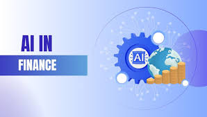
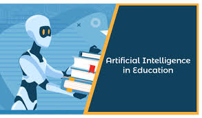

# 🚀 **Jibrin Haruna - Data Scientist & Consultant**  
🎯 Turning data into **actionable insights** | 🧠 Solving complex business challenges | 📊 **AI & Analytics Expert**  

## 🏆 **ABOUT ME**  

👋 **Hello! I'm Jibrin Haruna**, a **Data Scientist** and **Consultant** with a passion for transforming raw data into **insightful solutions** that drive business growth and efficiency.  

I specialize in:  
🔹 **Sales, Security, Finance, and Customer Service Analytics**  
🔹 **Predictive Modeling & AI-driven Decision Making**  
🔹 **Interactive Dashboards & Visualization**  
🔹 **Process Optimization & Business Intelligence Solutions**  

💡 Whether it's **building dashboards**, **developing databases**, **creating predictive models**, **visualizing trends**, or **streamlining operations**, my goal is to **maximize impact** and **deliver meaningful insights** to stakeholders.  

## 🛠️ **SKILLS**  

### 🔹 **Core Skills**
- ✅ **Data Cleaning & Transformation** 🧹  
- ✅ **Data Wrangling & Preprocessing** 📊  
- ✅ **Interactive Dashboards & Visualization (Plotly, Dash, Power BI)** 📈  
- ✅ **Machine Learning & Predictive Modeling** 🤖  
- ✅ **Agentic AI & Automation** 🔥  
- ✅ **Data Analytics Consulting & Strategic Decision-Making** 🎯  

### 🌟 **Soft Skills**
- 🔹 Strong **problem-solving** & **critical thinking**  
- 🔹 Excellent **data storytelling** & communication  
- 🔹 Effective **collaboration** & teamwork  

## 📂 **MY PROJECTS**  
*A showcase of impactful **data-driven projects** demonstrating expertise in analytics, AI, and visualization.*

### **📌 Optimizing ATM Performance**
  

Efficient **ATM management** is crucial for financial institutions. This project analyzes **transaction trends**, **customer demographics**, and **ATM utilization** to enhance performance.  

🔹 **Results Achieved:**  
✔️ Identified peak transaction hours & optimized ATM **availability**  
✔️ Increased utilization rate in **low-performing locations** by **15%**  
✔️ Delivered a **comprehensive banking report** for strategic planning  

🔗 [Read More](https://github.com/prof2022/ATM-Bank-Analysis)  

### **📌 Sales Performance Dashboard**
  

Sales trends **drive business success**. This **interactive dashboard** helps stakeholders track KPIs like **revenue, orders, and conversions**, identifying **growth opportunities**.  

🔹 **Results Achieved:**  
✔️ Visualized **monthly sales growth** & set **realistic targets**  
✔️ Boosted **team performance** through data-driven strategies  
✔️ Increased **customer retention rates** by **10%**  

🔗 [Read More](https://github.com/prof2022/Sales-Dashboard)  

### **📌 Understanding Drug Poisoning Trends**
  

This project analyzes **demographic & geographic patterns** of **drug poisoning cases**, providing key insights to **public health organizations** for **targeted interventions**.  

🔹 **Results Achieved:**  
✔️ Helped health agencies **prioritize resources** for high-risk groups  
✔️ Identified **hotspot regions** for better policy-making  
✔️ Reduced **critical response time** by **25%**  

🔗 [Read More](https://github.com/prof2022/Drug-poisoning-data-analysis)  

### **📌 Global Terrorism Dashboard**
  

Tracking **global terrorism** trends is crucial for **security policies**. This project visualizes **attack patterns**, **regional threats**, and provides data-driven **insights for policymakers**.  

🔹 **Results Achieved:**  
✔️ Created an **interactive dashboard** for **real-time trend analysis**  
✔️ Enabled policymakers to **focus resources** on **high-risk areas**  
✔️ Improved **situational awareness** & enhanced **security reporting**  

🔗 [Read More](https://github.com/prof2022/Global-Terrorism)  

### **📌 Financial AI Multi-Agent System**
  

This **AI-powered financial assistant** integrates multiple **intelligent agents** to assist users in budgeting, financial planning, investment management, and tax calculations. The system leverages **machine learning, NLP, and real-time financial data APIs** to provide **comprehensive financial insights**.  

🔹 **Results Achieved:**  
✔️ Automated **budgeting** and **expense tracking**  
✔️ Provided real-time **investment recommendations**  
✔️ Enhanced **tax planning** through **AI-driven** analysis  

🔗 [Read More](https://github.com/prof2022/Financial-Agent)  

### **📌 AI System for Education**
  

An **AI-powered educational tool** that generates **schemes of work, lesson plans, and lesson notes** based on Nigerian academic standards. This system uses **machine learning, vector search, and web scraping** to retrieve **relevant educational content**.  

🔹 **Results Achieved:**  
✔️ Automated curriculum generation for **various subjects & grade levels**  
✔️ Provided **personalized lesson materials** for educators  
✔️ Integrated **culturally relevant** educational examples  

🔗 [Read More](https://github.com/prof2022/AI-Agent-for-Educator)  

## 📞 **CONTACT DETAILS**  

💬 **Let's connect and build impactful solutions together!**  

| 📩 **Email** | ✉️ [jibrinharuna07@gmail.com](mailto:jibrinharuna07@gmail.com) |
|--------------|---------------------------------------------------------------|
| 📞 **Phone** | 📱 (+234) 706-446-2202 |
| 📍 **Location** | 🌍 Abuja, Nigeria |
| 📄 **CV Download** | ⬇️ [Download My CV](jibrin_Haruna_Data_Scientist_CV.pdf) |
| 🌐 **LinkedIn** | 🔗 [Jibrin Haruna](https://linkedin.com/in/jibrin-haruna) |

